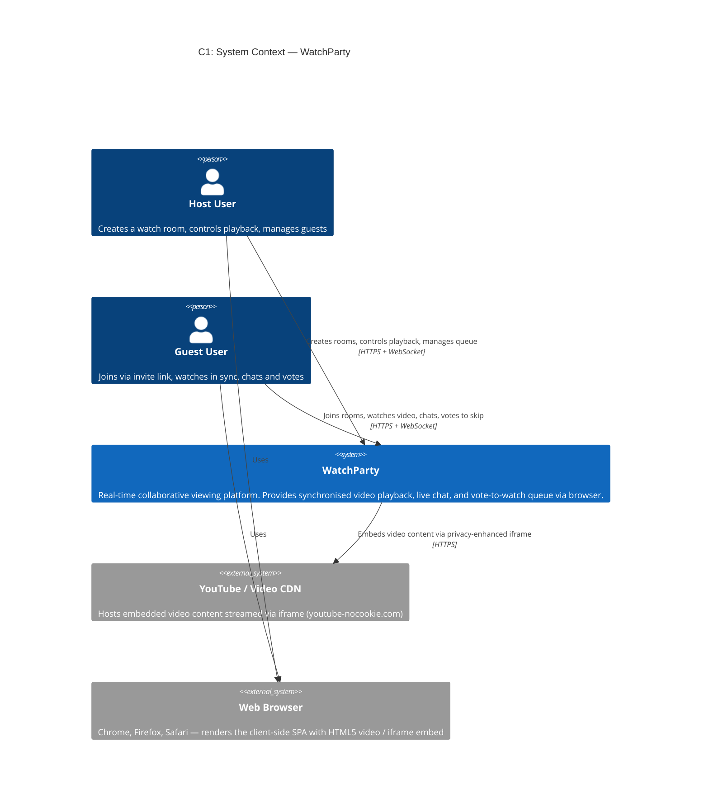
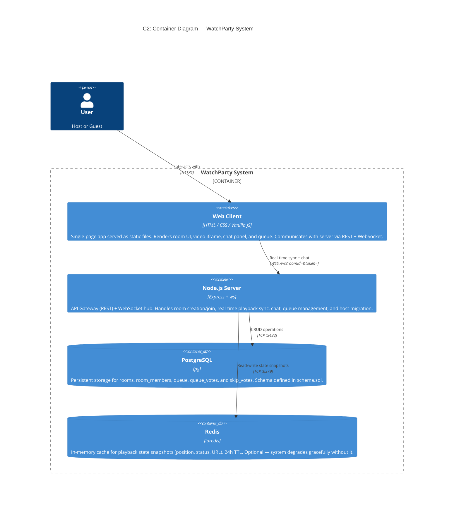
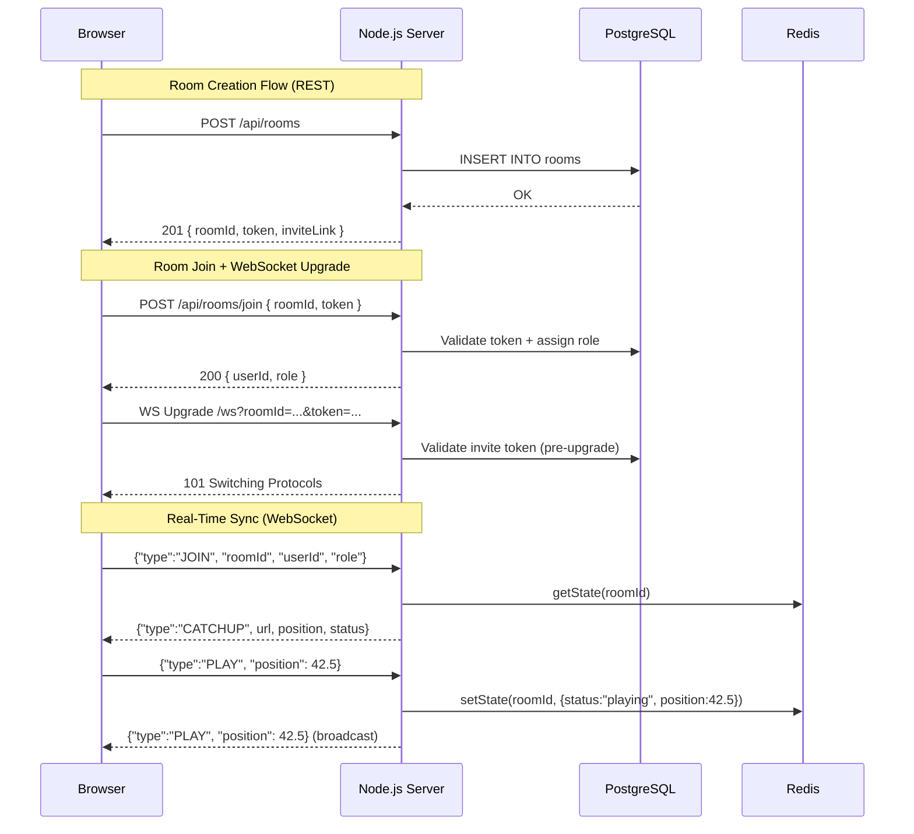
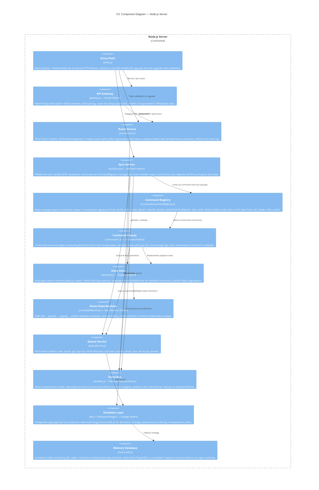
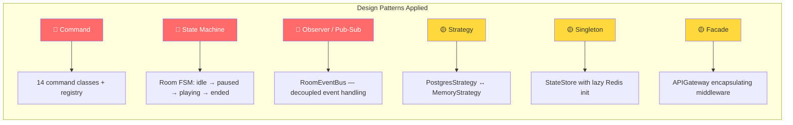

# WatchParty — Architecture Documentation

> C4 Model Diagrams + Architectural Decision Records (ADRs)

---

## Table of Contents

1. [C1: System Context Diagram](#c1-system-context-diagram)
2. [C2: Container Diagram](#c2-container-diagram)
3. [C3: Component Diagram](#c3-component-diagram)
4. [Architectural Decision Records (ADRs)](#architectural-decision-records)
   - [ADR-01: WebSocket for Real-Time Communication](#adr-01-websocket-for-real-time-communication)
   - [ADR-02: Host-Authoritative Sync Model](#adr-02-host-authoritative-sync-model)
   - [ADR-03: Command Pattern for Message Dispatch](#adr-03-command-pattern-for-message-dispatch)
   - [ADR-04: Strategy Pattern for Database Abstraction](#adr-04-strategy-pattern-for-database-abstraction)
   - [ADR-05: Dual-Layer State Store (Memory + Redis)](#adr-05-dual-layer-state-store-memory--redis)
   - [ADR-06: Token-Based Room Security with Pre-Upgrade Validation](#adr-06-token-based-room-security-with-pre-upgrade-validation)
   - [ADR-07: In-Memory Sliding-Window Rate Limiter](#adr-07-in-memory-sliding-window-rate-limiter)

---

## C1: System Context Diagram

The System Context diagram shows WatchParty as a black box, illustrating who uses it and what external systems it interacts with.



### Context Description

| Element | Description |
|---------|-------------|
| **Host User** | Any user who creates a watch room. They receive full playback control (play/pause/seek/load) and can grant co-host privileges. No account required. |
| **Guest User** | Joins a room via a shareable invite link. View-only by default but can nominate videos, upvote the queue, vote to skip, and send chat messages. |
| **WatchParty System** | The core platform — a Node.js server serving a browser-based SPA. Manages room lifecycle, real-time playback synchronisation (≤1 s drift), and collaborative features. |
| **YouTube / Video CDN** | External video provider. WatchParty normalises YouTube URLs to privacy-enhanced `youtube-nocookie.com/embed/` iframes with JS API enabled. |
| **Web Browser** | The user's browser (latest 2 stable versions of Chrome, Firefox, Safari per NFR-07). Renders the client SPA and connects via WebSocket. |

---

## C2: Container Diagram

The Container diagram zooms into the WatchParty system, showing the major runtime units and how they communicate.



### Container Details

| Container | Technology | Purpose | NFR Alignment |
|-----------|-----------|---------|---------------|
| **Web Client** | HTML, CSS, Vanilla JS (`public/`) | Two pages: `index.html` (landing/room creation) and `room.html` (the watch room with video player, chat, queue sidebar). Zero dependencies — no build step. | NFR-05 Usability, NFR-07 Browser Compat. |
| **Node.js Server** | Express 4.x, ws 8.x, Node.js | Entry point `server/index.js`. Handles HTTP requests via Express (room CRUD) and WebSocket connections for real-time sync. Single HTTP server shared between Express and `ws`. | NFR-01 Sync Latency, NFR-02 Availability |
| **PostgreSQL** | pg 8.x driver | 5 tables: `rooms`, `room_members`, `queue`, `queue_votes`, `skip_votes`. UUIDv7 for time-ordered IDs. Cascade deletes. Falls back to in-memory if unavailable. | NFR-04 Scalability |
| **Redis** | ioredis 5.x | Stores playback state as Redis hashes (`room:<id>:state`). Provides crash-recovery for the state store. If Redis is down, system runs in memory-only mode. | NFR-03 Fault Tolerance |

### Communication Protocols



---

## C3: Component Diagram

The Component diagram zooms into the **Node.js Server** container, showing internal modules and their responsibilities.



### Component Responsibilities

| Component | Design Pattern | Key Files | Functional Requirements |
|-----------|---------------|-----------|------------------------|
| **Entry Point** | — | [index.js](file:///Users/rahul/Documents/WatchParty/server/index.js) | Server bootstrap, graceful shutdown |
| **API Gateway** | Facade | [gateway.js](file:///Users/rahul/Documents/WatchParty/server/gateway.js) | NFR-04 Rate limiting, NFR-06 Security |
| **Room Service** | — | [roomService.js](file:///Users/rahul/Documents/WatchParty/server/roomService.js) | FR-01, FR-04, NFR-06 |
| **Sync Service** | Mediator | [syncService.js](file:///Users/rahul/Documents/WatchParty/server/syncService.js) | FR-02, FR-03, FR-07, FR-10 |
| **Command Registry** | Registry | [CommandRegistry.js](file:///Users/rahul/Documents/WatchParty/server/commands/CommandRegistry.js) | All FRs (dispatch layer) |
| **Command Classes** | Command | [commands/](file:///Users/rahul/Documents/WatchParty/server/commands/) | FR-02, FR-04, FR-05, FR-06, FR-08, FR-10 |
| **State Store** | Singleton | [stateStore.js](file:///Users/rahul/Documents/WatchParty/server/stateStore.js) | NFR-01, NFR-03 |
| **Room FSM** | State Machine | [roomStateMachine.js](file:///Users/rahul/Documents/WatchParty/server/roomStateMachine.js) | Room lifecycle integrity |
| **Queue Service** | — | [queueService.js](file:///Users/rahul/Documents/WatchParty/server/queueService.js) | FR-05, FR-06 |
| **Event Bus** | Observer / Pub-Sub | [eventBus.js](file:///Users/rahul/Documents/WatchParty/server/eventBus.js) | Decoupled event handling |
| **Database Layer** | Strategy | [db.js](file:///Users/rahul/Documents/WatchParty/server/db.js), [DatabaseStrategy.js](file:///Users/rahul/Documents/WatchParty/server/DatabaseStrategy.js) | NFR-03, NFR-08 |
| **Memory Database** | Strategy (concrete) | [memoryDb.js](file:///Users/rahul/Documents/WatchParty/server/memoryDb.js) | Dev/demo fallback |

---

## Architectural Decision Records

---

### ADR-01: WebSocket for Real-Time Communication

| Field | Value |
|-------|-------|
| **Status** | Accepted |
| **Date** | 2026-04-17 |
| **Deciders** | WatchParty Team |

#### Context

WatchParty requires real-time, bidirectional communication between the server and all connected clients to synchronise video playback commands (play, pause, seek) within ≤1 second (NFR-01). The system also supports live chat (FR-10), queue updates (FR-05), and member list changes — all of which require push-based delivery from server to client.

#### Decision

Use the **`ws` (WebSocket)** library for real-time communication, sharing a single HTTP server with Express via the `noServer` mode and manual upgrade handling.

**Architecture:**
- Express handles REST API requests (room creation/joining)
- `ws.Server` handles WebSocket connections on the `/ws` path
- Both share one `http.createServer()` instance on a single port

#### Alternatives Considered

| Alternative | Pros | Cons |
|-------------|------|------|
| **Socket.IO** | Auto-reconnect, rooms abstraction, fallback transports | Heavy dependency (~300 KB), unnecessary abstraction over raw WS, extra protocol overhead |
| **Server-Sent Events (SSE)** | Simple, HTTP-based, auto-reconnect | Unidirectional (server→client only); client→server still needs REST, doubling latency |
| **HTTP Long Polling** | Works everywhere, no upgrade needed | High latency (100–500 ms per poll), excessive server load at 10 users/room |

#### Consequences

- **Positive:** Sub-millisecond message delivery. Minimal overhead (~2 bytes per frame vs. HTTP headers). Full-duplex eliminates the need for separate REST calls for real-time commands. The `ws` library is lightweight (~50 KB) with zero dependencies.
- **Negative:** WebSocket connections are stateful; horizontal scaling requires sticky sessions or a pub/sub backplane (deferred for prototype scope of ≤20 rooms). Manual reconnection logic needed on the client side.
- **Risk:** Browser compatibility edge cases (mitigated by NFR-07 targeting latest 2 versions of Chrome/Firefox/Safari, all of which support WebSockets natively).

---

### ADR-02: Host-Authoritative Sync Model

| Field | Value |
|-------|-------|
| **Status** | Accepted |
| **Date** | 2026-04-17 |
| **Deciders** | WatchParty Team |

#### Context

Synchronising video playback across multiple clients introduces a distributed state problem. If multiple clients can independently issue play/pause/seek commands, conflict resolution becomes complex and drift is likely to exceed the 1-second NFR-01 threshold.

#### Decision

Adopt a **host-authoritative** model where a single user (the "host") is the sole source of truth for playback state. Only the host (or co-hosts granted via `GRANT_COHOST`) can issue PLAY, PAUSE, SEEK, and LOAD commands. The server validates this via `BaseCommand.isAuthorised()` before executing any playback-modifying command.

**Key rules:**
1. Room creator becomes the initial host (FR-04)
2. Guests have view-only playback access by default
3. Hosts can grant co-host privileges to specific guests
4. If the host disconnects, the longest-connected guest is auto-promoted within 3 seconds (FR-07, NFR-03)

#### Alternatives Considered

| Alternative | Pros | Cons |
|-------------|------|------|
| **Democratic / consensus-based** | Fair, no single point of control | Requires distributed consensus (Raft/Paxos-like), high complexity, latency spikes |
| **Last-write-wins (any client)** | Simple, no role management needed | Constant conflicts when multiple users seek simultaneously, unpredictable UX |
| **Peer-to-peer sync** | No server bottleneck, lower latency | NAT traversal complexity, unreliable on mobile networks, no central state for late-join |

#### Consequences

- **Positive:** Single source of truth eliminates conflict resolution entirely. Simple, deterministic state flow. Late-join catch-up (FR-03) is trivially implemented by reading the server's snapshot. Host migration (FR-07) is a straightforward role reassignment.
- **Negative:** Single point of dependency — if the host has high latency, all guests experience delayed commands. Mitigated by the 3-second auto-migration timer (NFR-03).
- **Trade-off:** Non-host users cannot directly control playback (by design), which could feel restrictive. Mitigated by the co-host grant mechanism (FR-04) and democratic features like skip voting (FR-06).

---

### ADR-03: Command Pattern for Message Dispatch

| Field | Value |
|-------|-------|
| **Status** | Accepted |
| **Date** | 2026-04-20 |
| **Deciders** | WatchParty Team |

#### Context

The initial implementation of `syncService.js` used a 300+ line `if/else` chain to handle 15+ WebSocket message types (PLAY, PAUSE, SEEK, LOAD, QUEUE_ADD, CHAT_MSG, etc.). Adding new message types required modifying the monolithic handler, violating the Open/Closed Principle and increasing regression risk (NFR-08).

#### Decision

Refactor message handling into the **Command Pattern** with three components:

1. **`BaseCommand`** — Abstract base class with shared context (roomId, userId, role), convenience methods (`send()`, `broadcast()`, `emitEvent()`), and abstract `validate()` / `execute()` methods.
2. **14 Concrete Commands** — One class per message type (e.g., `PlayCommand`, `ChatMsgCommand`, `SkipVoteCommand`), each self-contained with its own validation and execution logic.
3. **`CommandRegistry`** — A `Map<string, CommandClass>` that maps message type strings to constructors. `syncService.js` does a single lookup: `CommandRegistry.get(msg.type)`.

**Adding a new message type requires:**
1. Create a new file in `server/commands/` extending `BaseCommand`
2. Add one line to `CommandRegistry.js`
3. Zero changes to `syncService.js`

#### Alternatives Considered

| Alternative | Pros | Cons |
|-------------|------|------|
| **Keep if/else chain** | No refactoring needed | Unmaintainable at 15+ types, high coupling, difficult to test individual handlers |
| **Event-driven handlers** | Decoupled | Harder to enforce validation-before-execution, no clear ownership per message type |
| **Middleware chain (Express-style)** | Flexible composition | Over-engineered for WS messages, unclear flow for async operations |

#### Consequences

- **Positive:** Each command is independently testable. New features (e.g., adding a `REACTION` type) require zero changes to existing code. Validation logic (`validate()`) is co-located with execution logic (`execute()`), making authorization checks (host-only commands) explicit and auditable.
- **Negative:** 16 additional files in `server/commands/`. Higher initial file count, but each file is small (15–40 lines) and single-purpose.
- **Metrics:** `syncService.js` reduced from ~550 lines to ~378 lines. Command dispatch is now 5 lines of code instead of 300+.

---

### ADR-04: Strategy Pattern for Database Abstraction

| Field | Value |
|-------|-------|
| **Status** | Accepted |
| **Date** | 2026-04-20 |
| **Deciders** | WatchParty Team |

#### Context

The application needs to support two database modes:
1. **PostgreSQL** — for production and integration testing
2. **In-memory Maps** — for local development, demos, and when PostgreSQL is unavailable

The original implementation used a runtime boolean flag (`useMemory`) checked on every query call, leading to conditional branching throughout the data layer.

#### Decision

Apply the **Strategy Pattern** with three components:

1. **`DatabaseStrategy`** — Abstract base class defining the interface: `query(text, params)`, `initDb()`, and `get pool()`.
2. **`PostgresStrategy`** — Concrete strategy using the `pg` Pool. Configured with connection pooling (max 10, 30s idle timeout, 5s connection timeout).
3. **`MemoryStrategy`** — Concrete strategy using JavaScript Maps. Simulates SQL operations via regex pattern matching on query text. Implements the same interface.

**Strategy selection happens once at startup** in `db.js`:
- Try to create `PostgresStrategy` → if `pg` module or connection fails → fall back to `MemoryStrategy`
- The `initDb()` function has a secondary fallback: if PostgreSQL schema initialization fails at runtime, it seamlessly switches to `MemoryStrategy`

#### Alternatives Considered

| Alternative | Pros | Cons |
|-------------|------|------|
| **Keep runtime flag** | No refactoring needed | Conditional logic on every call, easy to miss a branch, violates OCP |
| **ORM (Sequelize, Prisma)** | Type safety, migrations, query builder | Heavy dependency for 5 simple tables, overkill for prototype scope |
| **SQLite for dev** | Real SQL, file-based | Needs native bindings (node-gyp), different SQL dialect from PostgreSQL |

#### Consequences

- **Positive:** Zero conditionals in calling code — `query()` delegates to whichever strategy was selected at startup. Alls callers (`roomService.js`, `queueService.js`) are completely unaware of which database backend is active. Clean separation of concerns.
- **Negative:** `MemoryStrategy` uses regex matching on SQL strings, which is fragile and must be updated when new query patterns are added. Acceptable for prototype scope.
- **Trade-off:** No ORM means raw SQL strings, but this keeps the dependency tree minimal (only `pg` driver) and gives full control over query optimization.

---

### ADR-05: Dual-Layer State Store (Memory + Redis)

| Field | Value |
|-------|-------|
| **Status** | Accepted |
| **Date** | 2026-04-20 |
| **Deciders** | WatchParty Team |

#### Context

Playback state (URL, position, status) must be read on every `SYNC_CHECK` and written on every PLAY/PAUSE/SEEK/LOAD command. These operations happen at high frequency (multiple times per second per room) and must complete in sub-millisecond time to meet the ≤1 second sync latency requirement (NFR-01). The state also needs to survive server restarts for fault tolerance (NFR-03).

#### Decision

Implement a **dual-layer state store** using the Singleton Pattern:

| Layer | Storage | Latency | Purpose |
|-------|---------|---------|---------|
| **Layer 1** | In-memory `Map` | ~µs | Hot path for all reads. Always available. |
| **Layer 2** | Redis hash | ~1 ms | Persistence across server restarts. Write-through from Layer 1. |

**Behaviour:**
- **Write path:** Write to memory Map → async write to Redis (fire-and-forget on failure)
- **Read path:** Read from memory Map → if miss, read from Redis → rehydrate memory
- **Redis failure:** System degrades to memory-only mode transparently. Logged as warning.
- **State Machine integration:** Every `setState()` call validates the transition via `RoomStateMachine` (idle → paused → playing → ended). Invalid transitions are logged but allowed for backward compatibility.

```
setState() → validate FSM transition → write to Map → async write to Redis
getState() → read from Map → (miss?) read from Redis → rehydrate Map
```

#### Alternatives Considered

| Alternative | Pros | Cons |
|-------------|------|------|
| **Redis only** | Single source of truth, simple | Network RTT (~1 ms) on every read, Redis becomes single point of failure |
| **Memory only** | Fastest, zero dependencies | State lost on restart, no crash recovery |
| **PostgreSQL for state** | Already integrated, ACID | 5–10 ms per read, unsustainable at high-frequency playback sync |

#### Consequences

- **Positive:** Sub-microsecond reads from memory for the hot path. Redis provides crash recovery without being on the critical path. Graceful degradation when Redis is unavailable — the system never hard-fails due to a cache dependency. Singleton pattern ensures exactly one store instance.
- **Negative:** Stale data possible if server crashes between memory write and Redis write (window: ~1 ms). Acceptable for a video position that will be re-synced within 1 second anyway.
- **Configuration:** Redis URL via `WP_REDIS_URL` env var. TTL set to 24 hours (matching NFR-06 token expiry). Connection timeout 3 seconds with max 2 retries.

---

### ADR-06: Token-Based Room Security with Pre-Upgrade Validation

| Field | Value |
|-------|-------|
| **Status** | Accepted |
| **Date** | 2026-04-21 |
| **Deciders** | WatchParty Team |

#### Context

Rooms must be accessible only via invite link, and tokens must expire after 24 hours of inactivity (NFR-06). The system has two entry points:
1. **REST API** — `POST /api/rooms/join` (returns userId and role)
2. **WebSocket upgrade** — `GET /ws?roomId=...&token=...` (establishes real-time connection)

Both entry points must validate the invite token. A malicious actor could bypass the REST validation by connecting directly to the WebSocket endpoint.

#### Decision

Implement **pre-upgrade WebSocket authentication** — validate the invite token **before** upgrading the HTTP connection to WebSocket:

1. **Token generation:** 32 bytes of `crypto.randomBytes` → 64-character hex string per room
2. **Token validation** (both REST and WS):
   - Room existence check via SQL
   - **Constant-time comparison** using `crypto.timingSafeEqual()` to prevent timing attacks
   - 24-hour inactivity expiry check against `last_active_at`
   - Activity refresh on successful validation
3. **Pre-upgrade enforcement:** In `index.js`, the `server.on('upgrade')` handler calls `validateInviteToken()` before `wss.handleUpgrade()`. Invalid tokens receive a `403 Forbidden` HTTP response and the socket is destroyed — the connection never upgrades to WebSocket.

```
Client → HTTP Upgrade Request (/ws?token=...)
  └→ index.js 'upgrade' handler
       └→ validateInviteToken(roomId, token)
            ├→ ❌ Invalid → 403 + socket.destroy() (never upgrades)
            └→ ✅ Valid → wss.handleUpgrade() → WebSocket established
```

#### Alternatives Considered

| Alternative | Pros | Cons |
|-------------|------|------|
| **Post-upgrade auth (validate after WS connects)** | Simpler implementation | WebSocket connection established before auth — resource waste, potential DoS vector |
| **Session cookies** | Standard HTTP auth | Doesn't work well with WebSocket upgrade, requires cookie management |
| **JWT tokens** | Stateless, self-contained | Adds a dependency, can't be revoked easily, expiry is at token level not inactivity-based |
| **Password-protected rooms** | Simple UX | Requires users to remember/share passwords, no inactivity expiry |

#### Consequences

- **Positive:** Zero unauthorized WebSocket connections — resources are never allocated for invalid tokens. Timing-safe comparison prevents side-channel attacks. Inactivity-based expiry (not absolute) means active rooms stay alive indefinitely while abandoned rooms auto-expire.
- **Negative:** Token is visible in the URL query string (invite link), which could be shared unintentionally. Mitigated by the 24-hour inactivity expiry.
- **Implementation note:** The `last_active_at` field is updated on every successful token validation, effectively creating a sliding window of 24 hours from last use.

---

### ADR-07: In-Memory Sliding-Window Rate Limiter

| Field | Value |
|-------|-------|
| **Status** | Accepted |
| **Date** | 2026-04-22 |
| **Deciders** | WatchParty Team |

#### Context

The REST API (`/api/rooms`, `/api/rooms/join`, `/api/health`) needs protection against abuse and denial-of-service attempts (NFR-04 Scalability, NFR-06 Security). The prototype targets ≤20 simultaneous rooms, making expensive distributed rate limiting unnecessary.

#### Decision

Implement an **in-memory sliding-window rate limiter** within the `APIGateway` class:

- **Window:** 60 seconds (configurable via constructor)
- **Limit:** 100 requests per IP per window (configurable)
- **Algorithm:** For each request, filter the IP's timestamp array to keep only entries within the window, then check length against limit
- **Memory management:** A `setInterval` prune job runs every 5 minutes, removing IPs with no hits in the current window. Timer uses `.unref()` to avoid blocking Node.js process shutdown.

```javascript
// Pseudocode
const hits = ipWindows.get(ip).filter(t => now - t < windowMs);
hits.push(now);
if (hits.length > rateLimit) return 429;
```

#### Alternatives Considered

| Alternative | Pros | Cons |
|-------------|------|------|
| **Redis-backed rate limiter** | Shared across instances, persistent | Adds Redis dependency to REST path, overkill for single-instance prototype |
| **`express-rate-limit` middleware** | Battle-tested, configurable | External dependency, fixed-window algorithm (less accurate), doesn't integrate with Facade pattern |
| **Token bucket algorithm** | Smoother burst handling | More complex implementation, harder to explain in academic context |
| **No rate limiting** | Simplest | Vulnerable to DoS, fails NFR-06 security audit |

#### Consequences

- **Positive:** Zero external dependencies. Sliding window is more accurate than fixed-window (no burst at window boundaries). Configurable via constructor for testing (e.g., `new APIGateway({ rateLimit: 5, windowMs: 1000 })`). Prune job prevents unbounded memory growth.
- **Negative:** Not shared across multiple server instances (if horizontally scaled). Acceptable for the prototype's single-instance deployment model (NFR-04: ≤20 rooms).
- **Monitoring:** Prune job logs the count of removed IPs in non-test environments for operational visibility.

---

## Appendix: Design Pattern Summary



> 🔴 = High-impact pattern &nbsp;&nbsp; 🟡 = Medium-impact pattern
