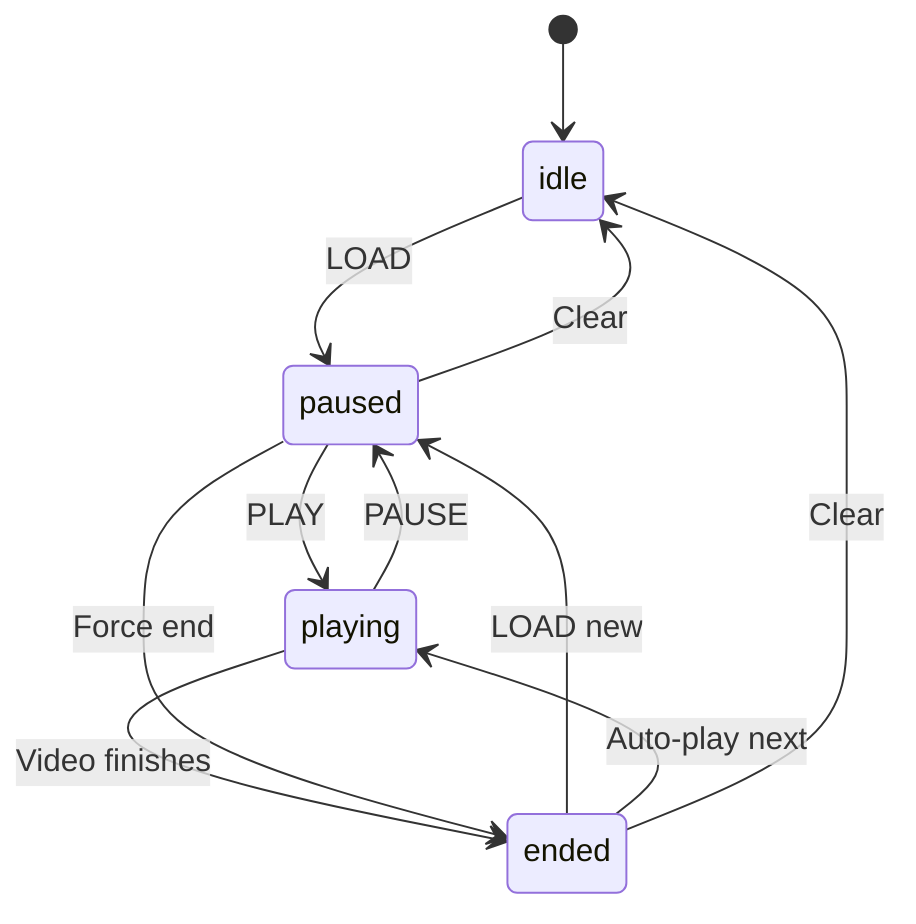

# WatchParty — Design Pattern Refactoring Walkthrough

## Summary

Applied **6 design patterns** (3 high-impact, 3 medium-impact) to the WatchParty codebase, aligning the implementation with the architectural claims in the requirements document (Section 4). All 31 existing tests continue to pass.

---

## Patterns Implemented

### 🔴 1. Command Pattern — `server/commands/`

**Problem**: `syncService.js` had a 300+ line `if/else` chain handling 15+ message types.

**Solution**: Decomposed into 14 discrete command classes + 1 registry.

| File | Message Type | FR |
|------|-------------|-----|
| [BaseCommand.js](file:///Users/shubhampaliwal/Downloads/WatchParty/server/commands/BaseCommand.js) | Abstract base | — |
| [PlayCommand.js](file:///Users/shubhampaliwal/Downloads/WatchParty/server/commands/PlayCommand.js) | `PLAY` | FR-02 |
| [PauseCommand.js](file:///Users/shubhampaliwal/Downloads/WatchParty/server/commands/PauseCommand.js) | `PAUSE` | FR-02 |
| [SeekCommand.js](file:///Users/shubhampaliwal/Downloads/WatchParty/server/commands/SeekCommand.js) | `SEEK` | FR-02 |
| [LoadCommand.js](file:///Users/shubhampaliwal/Downloads/WatchParty/server/commands/LoadCommand.js) | `LOAD` | FR-02 |
| [GrantCohostCommand.js](file:///Users/shubhampaliwal/Downloads/WatchParty/server/commands/GrantCohostCommand.js) | `GRANT_COHOST` | FR-04 |
| [QueueAddCommand.js](file:///Users/shubhampaliwal/Downloads/WatchParty/server/commands/QueueAddCommand.js) | `QUEUE_ADD` | FR-05 |
| [QueueUpvoteCommand.js](file:///Users/shubhampaliwal/Downloads/WatchParty/server/commands/QueueUpvoteCommand.js) | `QUEUE_UPVOTE` | FR-05 |
| [QueueRemoveCommand.js](file:///Users/shubhampaliwal/Downloads/WatchParty/server/commands/QueueRemoveCommand.js) | `QUEUE_REMOVE` | FR-05 |
| [SkipVoteCommand.js](file:///Users/shubhampaliwal/Downloads/WatchParty/server/commands/SkipVoteCommand.js) | `SKIP_VOTE` | FR-06 |
| [VideoEndedCommand.js](file:///Users/shubhampaliwal/Downloads/WatchParty/server/commands/VideoEndedCommand.js) | `VIDEO_ENDED` | FR-05 |
| [ChatMsgCommand.js](file:///Users/shubhampaliwal/Downloads/WatchParty/server/commands/ChatMsgCommand.js) | `CHAT_MSG` | FR-10 |
| [ChatReactionCommand.js](file:///Users/shubhampaliwal/Downloads/WatchParty/server/commands/ChatReactionCommand.js) | `CHAT_REACTION` | FR-10 |
| [SetNameCommand.js](file:///Users/shubhampaliwal/Downloads/WatchParty/server/commands/SetNameCommand.js) | `SET_NAME` | FR-08 |
| [SyncCheckCommand.js](file:///Users/shubhampaliwal/Downloads/WatchParty/server/commands/SyncCheckCommand.js) | `SYNC_CHECK` | NFR-01 |
| [CommandRegistry.js](file:///Users/shubhampaliwal/Downloads/WatchParty/server/commands/CommandRegistry.js) | Registry map | — |

**Key benefit**: Adding a new message type = 1 new file + 1 registry entry. Zero changes to `syncService.js`.

---

### 🔴 2. State Machine — `server/roomStateMachine.js`

**File**: [roomStateMachine.js](file:///Users/shubhampaliwal/Downloads/WatchParty/server/roomStateMachine.js)

Defines the room lifecycle with validated transitions:



Integrated into [stateStore.js](file:///Users/shubhampaliwal/Downloads/WatchParty/server/stateStore.js) — every `setState()` call validates the transition. Invalid transitions log a warning but are allowed for backward compatibility.

---

### 🔴 3. Observer / Pub-Sub — `server/eventBus.js`

**File**: [eventBus.js](file:///Users/shubhampaliwal/Downloads/WatchParty/server/eventBus.js)

Room-scoped event bus that decouples event production from consumption:

- **Producers**: Command classes emit events via `this.emitEvent('playback:play', { position })`
- **Consumers**: Registered in [syncService.js](file:///Users/shubhampaliwal/Downloads/WatchParty/server/syncService.js#L205-L210) for logging; future modules can subscribe for analytics, notifications, etc.
- **Cleanup**: `eventBus.teardownRoom(roomId)` on room destruction

---

### 🟡 4. Strategy Pattern — `server/db.js` + `server/memoryDb.js`

**Files**: [db.js](file:///Users/shubhampaliwal/Downloads/WatchParty/server/db.js), [memoryDb.js](file:///Users/shubhampaliwal/Downloads/WatchParty/server/memoryDb.js), [DatabaseStrategy.js](file:///Users/shubhampaliwal/Downloads/WatchParty/server/DatabaseStrategy.js)

**Before**: Runtime boolean flag (`useMemory`) checked on every query call.

**After**: `DatabaseStrategy` interface with `PostgresStrategy` and `MemoryStrategy` implementations. Strategy selected once at startup. `MemoryStrategy` extends `DatabaseStrategy` class.

---

### 🟡 5. Singleton Pattern — `server/stateStore.js`

**File**: [stateStore.js](file:///Users/shubhampaliwal/Downloads/WatchParty/server/stateStore.js)

**Before**: Module-level `let redis = null` with side-effect connection on `require()`.

**After**: `StateStore` class with `static getInstance()`, lazy Redis connection, and `resetInstance()` for testing. Module exports backward-compatible functions.

---

### 🟡 6. Facade Pattern — `server/gateway.js`

**File**: [gateway.js](file:///Users/shubhampaliwal/Downloads/WatchParty/server/gateway.js)

**Before**: Loose functions and middleware in a flat module.

**After**: `APIGateway` class encapsulating rate limiting, middleware setup, and route mounting behind a clean constructor-based interface.

---

## Test Results

```
Test Suites: 3 passed, 3 total
Tests:       31 passed, 31 total
Time:        3.85 s
```

> [!NOTE]
> Fixed pre-existing test issues in `queue.test.js` where SQL regex pattern collisions (`INSERT INTO queue` matching `INSERT INTO queue_votes`) were masked before our refactoring surfaced them.

---

## Files Changed

### New Files (18)

| File | Pattern |
|------|---------|
| `server/eventBus.js` | Observer/Pub-Sub |
| `server/roomStateMachine.js` | State Machine |
| `server/DatabaseStrategy.js` | Strategy |
| `server/commands/BaseCommand.js` | Command |
| `server/commands/PlayCommand.js` | Command |
| `server/commands/PauseCommand.js` | Command |
| `server/commands/SeekCommand.js` | Command |
| `server/commands/LoadCommand.js` | Command |
| `server/commands/GrantCohostCommand.js` | Command |
| `server/commands/QueueAddCommand.js` | Command |
| `server/commands/QueueUpvoteCommand.js` | Command |
| `server/commands/QueueRemoveCommand.js` | Command |
| `server/commands/SkipVoteCommand.js` | Command |
| `server/commands/VideoEndedCommand.js` | Command |
| `server/commands/ChatMsgCommand.js` | Command |
| `server/commands/ChatReactionCommand.js` | Command |
| `server/commands/SetNameCommand.js` | Command |
| `server/commands/SyncCheckCommand.js` | Command |
| `server/commands/CommandRegistry.js` | Command |

### Modified Files (5)

| File | Changes |
|------|---------|
| `server/syncService.js` | Replaced 300+ line if/else with Command dispatch + EventBus integration |
| `server/stateStore.js` | Singleton class + State Machine validation |
| `server/db.js` | Strategy pattern with PostgresStrategy |
| `server/memoryDb.js` | Extends DatabaseStrategy interface |
| `server/gateway.js` | APIGateway Facade class |

### Test Fixes (1)

| File | Fix |
|------|-----|
| `tests/queue.test.js` | Fixed SQL regex collisions, added normalization, renamed mock variables for Jest compliance |
