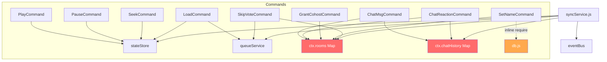
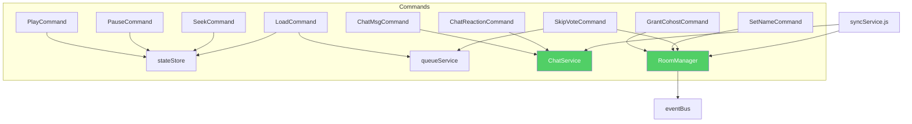

# WatchParty — Design Smell Analysis & Class-Level Refactoring Opportunities

> Deep analysis of the codebase identifying design smells, anti-patterns, and actionable refactoring suggestions.

---

## Summary

| # | Smell | Severity | Affected Files | Refactoring |
|---|-------|----------|---------------|-------------|
| 1 | **God Class** | 🔴 Critical | `syncService.js` (378 lines, 7+ responsibilities) | Extract `RoomManager` class |
| 2 | **God Class** | 🔴 Critical | `room.js` (1308 lines, 8+ concerns) | Extract client-side classes |
| 3 | **Duplicated Code** (clones) | 🟡 Major | `ChatMsgCommand` ↔ `ChatReactionCommand` | Extract `ChatService` |
| 4 | **Duplicated Code** | 🟡 Major | `normaliseUrl()` in `syncService.js` ↔ `LoadCommand.js` | Extract `UrlNormalizer` utility |
| 5 | **Feature Envy** | 🟡 Major | `ChatMsgCommand`, `ChatReactionCommand` | Move chat history logic to its own class |
| 6 | **Inappropriate Intimacy** | 🟡 Major | Commands accessing `this.ctx.rooms`, `this.ctx.chatHistory` | Slim down context, expose operations not data structures |
| 7 | **Shotgun Surgery** | 🟠 Moderate | `SetNameCommand.js` — inline `require('../db')` | Inject DB dependency through context |
| 8 | **Refused Bequest** | 🟠 Moderate | `SyncCheckCommand`, `VideoEndedCommand` | Consider lightweight interface |
| 9 | **Primitive Obsession** | 🟠 Moderate | Member objects built as plain `{}` literals everywhere | Extract `RoomMember` value class |
| 10 | **Data Clump** | 🟠 Moderate | `{ roomId, userId, userRole, ws }` passed as loose context | Extract `ConnectionContext` class |

---

## Smell 1 — God Class: `syncService.js`

> **Severity: 🔴 Critical** &nbsp;|&nbsp; **Pattern: God Class / Blob**

### Evidence

[syncService.js](file:///Users/rahul/Documents/WatchParty/server/syncService.js) is 378 lines and handles **7 distinct responsibilities**:

| Responsibility | Lines | Methods |
|---------------|-------|---------|
| Room member tracking | 63–68, 248–262 | `rooms` Map, JOIN handling |
| Chat history management | 67, 284–287, 356 | `chatHistory` Map, history delivery |
| WebSocket send/broadcast | 81–104 | `send()`, `broadcast()`, `broadcastMemberList()` |
| Queue broadcasting | 109–126 | `broadcastQueue()`, `broadcastSkipStatus()` |
| Auto-play orchestration | 132–158 | `playNextFromQueue()` |
| URL normalization | 162–176 | `normaliseUrl()` |
| Host migration | 180–209 | `scheduleHostMigration()` |

Despite the Command Pattern refactoring (which successfully extracted message handling), `syncService.js` still acts as a **Mediator + Registry + Service Locator + Chat Store** — it owns too many unrelated data structures (`rooms`, `chatHistory`) and orchestrates too many concerns.

### Proposed Refactoring: Extract `RoomManager`

```
syncService.js (current — God Class)
  ├── rooms Map
  ├── chatHistory Map
  ├── send/broadcast helpers
  ├── playNextFromQueue
  ├── normaliseUrl
  ├── scheduleHostMigration
  └── handleConnection (WS handler)

         ⬇ refactor into ⬇

RoomManager.js (new — extracted class)
  ├── rooms Map
  ├── addMember(roomId, userId, memberInfo)
  ├── removeMember(roomId, userId)
  ├── getMembers(roomId)
  ├── getMember(roomId, userId)
  ├── broadcast(roomId, obj, excludeUserId)
  ├── broadcastMemberList(roomId)
  └── isEmpty(roomId) / cleanup(roomId)

ChatHistoryStore.js (new — extracted class)
  ├── chatHistory Map
  ├── append(roomId, message)
  ├── getHistory(roomId)
  └── clear(roomId)

syncService.js (slimmed — orchestration only)
  ├── handleConnection (WS handler)
  ├── JOIN logic (delegates to RoomManager)
  └── close/disconnect logic
```

> [!IMPORTANT]
> This extraction reduces `syncService.js` from a God Class → a thin orchestrator. The `RoomManager` becomes independently testable without WebSocket mocking.

---

## Smell 2 — God Class: `room.js` (Client)

> **Severity: 🔴 Critical** &nbsp;|&nbsp; **Pattern: God Class / Blob**

### Evidence

[room.js](file:///Users/rahul/Documents/WatchParty/public/js/room.js) is **1308 lines** with 8+ distinct concerns in a single file:

| Concern | Approx. Lines |
|---------|--------------|
| YouTube IFrame Player management | 139–610 (~470 lines) |
| WebSocket connection + reconnect | 680–734 |
| Message dispatch (`handleMessage` switch) | 737–848 |
| Member list rendering | 850–867 |
| Queue UI (render, add, upvote, remove) | 870–958 |
| Skip vote UI | 960–976 |
| Chat UI (messages, reactions, history) | 978–1085 |
| Host controls (play, seek, keyboard) | 1102–1233 |

The file also has **~20 module-level mutable variables** (`ytPlayer`, `ytReady`, `seekPending`, `poller`, `syncVerificationTimer`, `localPosition`, `localStatus`, `localDuration`, `activeVideoId`, `pendingVideoId`, `pendingPlayerState`, `pendingRetryTimer`, etc.) — a hallmark of procedural code posing as modular JavaScript.

### Proposed Refactoring: Extract Client-Side Modules

```
room.js (1308 lines → thin bootstrap)

  PlayerController.js (~400 lines)
    ├── YouTube IFrame lifecycle
    ├── Player state machine (create, cue, play, pause, seek)
    ├── Seek bar poller
    └── Sync verification

  WebSocketClient.js (~100 lines)
    ├── connect(), reconnect()
    ├── sendWs(), onMessage()
    └── handleMessage() dispatch

  ChatRenderer.js (~100 lines)
    ├── renderChatMessage(), renderChatReaction()
    ├── renderChatHistory()
    └── sendChat(), sendReaction()

  QueueRenderer.js (~80 lines)
    ├── renderQueue()
    ├── addToQueue(), upvoteQueue(), removeFromQueue()
    └── extractVideoLabel()

  room.js (bootstrap — ~100 lines)
    ├── init(), applyRoleUI()
    ├── Wire up modules
    └── DOM refs
```

> [!NOTE]
> Since the client uses vanilla JS (no build step), these could be separate `<script>` files loaded in order, or use ES modules (`type="module"`) for modern browsers — both compatible with NFR-07.

---

## Smell 3 — Duplicated Code: `ChatMsgCommand` ↔ `ChatReactionCommand`

> **Severity: 🟡 Major** &nbsp;|&nbsp; **Pattern: Code Clones (Type-2 Clone)**

### Evidence

These two commands share **identical** chat history management logic (lines 32–38 in both files):

```diff
 // ChatMsgCommand.js:32-38                    // ChatReactionCommand.js:32-38
 if (!this.ctx.chatHistory.has(this.roomId)) {  if (!this.ctx.chatHistory.has(this.roomId)) {
   this.ctx.chatHistory.set(this.roomId, []);     this.ctx.chatHistory.set(this.roomId, []);
 }                                              }
 const history = this.ctx.chatHistory            const history = this.ctx.chatHistory
   .get(this.roomId);                              .get(this.roomId);
 history.push(chatMsg);                          history.push(reactionMsg);
 if (history.length > MAX_CHAT_HISTORY)          if (history.length > MAX_CHAT_HISTORY)
   history.shift();                                history.shift();
```

Both also duplicate the `MAX_CHAT_HISTORY = 200` constant.

### Proposed Refactoring: Extract `ChatService`

```javascript
// ChatService.js — single owner of chat history logic
class ChatService {
  static MAX_HISTORY = 200;

  constructor(chatHistoryMap) {
    this.history = chatHistoryMap;
  }

  append(roomId, message) {
    if (!this.history.has(roomId)) this.history.set(roomId, []);
    const list = this.history.get(roomId);
    list.push(message);
    if (list.length > ChatService.MAX_HISTORY) list.shift();
  }

  getHistory(roomId) { return this.history.get(roomId) ?? []; }
  clear(roomId) { this.history.delete(roomId); }
}
```

Both commands would then call `this.ctx.chatService.append(this.roomId, msg)` — one line instead of six.

---

## Smell 4 — Duplicated Code: `normaliseUrl()` exists in two places

> **Severity: 🟡 Major** &nbsp;|&nbsp; **Pattern: Code Clones (Type-1 Clone)**

### Evidence

The YouTube URL normalization logic is duplicated:

| Location | Function | Used By |
|----------|----------|---------|
| [syncService.js:162-176](file:///Users/rahul/Documents/WatchParty/server/syncService.js#L162-L176) | `normaliseUrl(raw)` | `playNextFromQueue()` |
| [LoadCommand.js:38-52](file:///Users/rahul/Documents/WatchParty/server/commands/LoadCommand.js#L38-L52) | `_normaliseUrl(raw)` | `validate()` and `execute()` |

Both are functionally identical — YouTube URL → `youtube-nocookie.com/embed/` conversion.

### Proposed Refactoring: Extract `urlUtils.js`

```javascript
// server/urlUtils.js
function normaliseUrl(raw) {
  try {
    const url = new URL(raw);
    let videoId = url.searchParams.get('v');
    if (!videoId && url.hostname === 'youtu.be') {
      videoId = url.pathname.slice(1);
    }
    if (videoId) {
      return `https://www.youtube-nocookie.com/embed/${videoId}?enablejsapi=1&rel=0`;
    }
    return raw;
  } catch {
    return null;
  }
}
module.exports = { normaliseUrl };
```

---

## Smell 5 — Feature Envy: Chat Commands reach into Mediator's data

> **Severity: 🟡 Major** &nbsp;|&nbsp; **Pattern: Feature Envy**

### Evidence

`ChatMsgCommand` and `ChatReactionCommand` exhibit **Feature Envy** — they are more interested in `syncService`'s data structures than their own:

```javascript
// ChatMsgCommand.js:22 — reaches into rooms Map to get displayName
const member = this.ctx.rooms.get(this.roomId)?.get(this.userId);

// ChatMsgCommand.js:33-38 — directly manipulates chatHistory Map
if (!this.ctx.chatHistory.has(this.roomId)) {
  this.ctx.chatHistory.set(this.roomId, []);
}
const history = this.ctx.chatHistory.get(this.roomId);
history.push(chatMsg);
```

The commands are doing the work that properly belongs to the data owners (`RoomManager` for member lookup, `ChatService` for history).

### Root Cause

The `context` object passed to commands exposes **raw data structures** (`rooms` Map, `chatHistory` Map) instead of **behavioral abstractions**. This violates the Tell, Don't Ask principle.

### Fix

After extracting `RoomManager` and `ChatService` (Smells 1 & 3), commands would call:
```javascript
const member = this.ctx.roomManager.getMember(this.roomId, this.userId);
this.ctx.chatService.append(this.roomId, chatMsg);
```

---

## Smell 6 — Inappropriate Intimacy: Command Context exposes internal Maps

> **Severity: 🟡 Major** &nbsp;|&nbsp; **Pattern: Inappropriate Intimacy**

### Evidence

The context object built in [syncService.js:311-325](file:///Users/rahul/Documents/WatchParty/server/syncService.js#L311-L325) passes raw internal data structures to commands:

```javascript
const context = {
  roomId, userId, userRole, ws,
  rooms,        // ← raw Map<roomId, Map<userId, memberInfo>>
  chatHistory,  // ← raw Map<roomId, chatMessage[]>
  eventBus,
  send, broadcast, broadcastMemberList,
  broadcastQueue, broadcastSkipStatus, playNextFromQueue,
};
```

Commands like `GrantCohostCommand`, `ChatMsgCommand`, `SetNameCommand`, and `SkipVoteCommand` directly reach into `this.ctx.rooms` to:
- Get member count (`this.ctx.rooms.get(this.roomId)?.size`)
- Mutate member role (`target.role = 'co-host'`)
- Access WebSocket (`target.ws.send(...)`)
- Get display names

This couples commands tightly to `syncService`'s internal representation.

### Proposed Refactoring: Expose Operations, Not Data

```javascript
// Instead of passing raw Maps, expose an interface:
const context = {
  roomId, userId, userRole,

  // Room operations (delegate to RoomManager)
  getMember:       (uid) => roomManager.getMember(roomId, uid),
  getMemberCount:  ()    => roomManager.getMemberCount(roomId),
  setMemberRole:   (uid, role) => roomManager.setRole(roomId, uid, role),
  sendToMember:    (uid, msg)  => roomManager.sendTo(roomId, uid, msg),

  // Chat operations (delegate to ChatService)
  appendChat:      (msg) => chatService.append(roomId, msg),

  // Existing broadcast helpers...
  send, broadcast, broadcastMemberList,
  broadcastQueue, broadcastSkipStatus, playNextFromQueue,
  eventBus,
};
```

---

## Smell 7 — Shotgun Surgery: `SetNameCommand` inline-requires `db`

> **Severity: 🟠 Moderate** &nbsp;|&nbsp; **Pattern: Shotgun Surgery**

### Evidence

[SetNameCommand.js:28-30](file:///Users/rahul/Documents/WatchParty/server/commands/SetNameCommand.js#L28-L30) has an **inline `require`** inside `execute()`:

```javascript
async execute(msg) {
  // ...
  try {
    const { query: dbQuery } = require('../db');  // ← inline require!
    await dbQuery(
      `UPDATE room_members SET display_name = $1 ...`,
      [newName, this.roomId, this.userId]
    );
  } catch { /* DB unavailable */ }
}
```

**Problems:**
1. **Inconsistency:** All other commands access services via `this.ctx` or module-level `require`. This one does an inline `require` inside a method body.
2. **Hidden dependency:** The DB dependency is invisible from the constructor/module imports.
3. **Untestable:** Mocking `require('../db')` inside a method body is much harder than injecting via context.
4. **Shotgun Surgery:** If the DB access pattern changes (e.g., switching from `query` to a `roomService.updateDisplayName()` method), you'd need to find and update this buried `require`.

### Fix

Either:
- **(A)** Add `dbQuery` to the command context: `this.ctx.query(...)`
- **(B)** Better: Add `updateDisplayName(roomId, userId, name)` to `roomService.js` and call it via context

---

## Smell 8 — Refused Bequest: `SyncCheckCommand` and `VideoEndedCommand` 

> **Severity: 🟠 Moderate** &nbsp;|&nbsp; **Pattern: Refused Bequest**

### Evidence

Two commands inherit the full `BaseCommand` interface but barely use it:

**`SyncCheckCommand`** — only logs, never writes state or broadcasts:
```javascript
class SyncCheckCommand extends BaseCommand {
  async execute(msg) {
    // Just logs... that's it
    if (this.isAuthorised()) {
      console.log(`[sync] SYNC_CHECK from guest...`);
    }
  }
}
```

**`VideoEndedCommand`** — delegates everything, has no validation:
```javascript
class VideoEndedCommand extends BaseCommand {
  async execute(msg) {
    if (this.isAuthorised()) {
      await this.ctx.playNextFromQueue();  // single delegation call
      this.emitEvent('playback:ended');
    }
  }
}
```

These classes inherit `validate()`, `send()`, `broadcast()`, `broadcastMemberList()`, `emitEvent()`, access to `ctx.rooms`, `ctx.chatHistory`, etc. — vast capabilities they never use.

### Assessment

This is a mild case. The Command Pattern's uniformity is arguably more valuable than the slight inheritance overhead. However, if the pattern grows further, consider:
- A lighter-weight `ReadOnlyCommand` base for observation-only commands
- Making validation optional via a null-object default (already done — `BaseCommand.validate()` returns `{ valid: true }`)

---

## Smell 9 — Primitive Obsession: Member objects as plain literals

> **Severity: 🟠 Moderate** &nbsp;|&nbsp; **Pattern: Primitive Obsession / Missing Domain Object**

### Evidence

Room members are stored as plain object literals with no type enforcement:

```javascript
// syncService.js:258-262
members.set(userId, {
  ws, userId, role: userRole,
  displayName: msg.displayName ?? 'Guest',
  joinedAt: Date.now(),
});
```

This shape is informally repeated across:
- `syncService.js` (creation)
- `GrantCohostCommand.js` (mutation: `target.role = 'co-host'`)
- `SetNameCommand.js` (mutation: `member.displayName = newName`)
- `ChatMsgCommand.js` / `ChatReactionCommand.js` (read: `member?.displayName`)
- `broadcastMemberList()` (projection to `{ userId, displayName, role }`)

No validation, no encapsulation, no invariant enforcement.

### Proposed Refactoring: Extract `RoomMember` Value Class

```javascript
class RoomMember {
  constructor({ ws, userId, role = 'guest', displayName = 'Guest' }) {
    this.ws = ws;
    this.userId = userId;
    this.role = role;
    this.displayName = displayName.slice(0, 32);
    this.joinedAt = Date.now();
  }

  isHost()     { return this.role === 'host' || this.role === 'co-host'; }
  promote(role) { this.role = role; }
  rename(name)  { this.displayName = name.slice(0, 32); }
  toJSON()     { return { userId: this.userId, displayName: this.displayName, role: this.role }; }
}
```

---

## Smell 10 — Data Clump: Context object is an ad-hoc bag

> **Severity: 🟠 Moderate** &nbsp;|&nbsp; **Pattern: Data Clump**

### Evidence

The context object constructed in [syncService.js:311-325](file:///Users/rahul/Documents/WatchParty/server/syncService.js#L311-L325) is a 14-property ad-hoc object literal:

```javascript
const context = {
  roomId, userId, userRole, ws,
  rooms, chatHistory, eventBus,
  send:                (obj) => send(ws, obj),
  broadcast:           (obj, exclude) => broadcast(roomId, obj, exclude),
  broadcastMemberList: ()    => broadcastMemberList(roomId),
  broadcastQueue:      ()    => broadcastQueue(roomId),
  broadcastSkipStatus: (cnt) => broadcastSkipStatus(roomId, cnt),
  playNextFromQueue:   ()    => playNextFromQueue(roomId),
};
```

This shape is never formalized. If any command needs a new contextual operation, `syncService.js` must be modified (Shotgun Surgery). No type checking, no documentation of which commands use which context properties.

### Fix

Formalize as a `CommandContext` class that encapsulates the room scope and exposes a clean API. This pairs naturally with the `RoomManager` and `ChatService` extractions from Smells 1 and 3.

---

## Dependency Graph — Current vs. Proposed

### Current (tangled)



### Proposed (clean boundaries)



---

## Prioritized Action Plan

| Priority | Refactoring | Effort | Impact | Risk |
|----------|------------|--------|--------|------|
| 1 | Extract `ChatService` from duplicated chat commands (Smells 3 + 5) | Low | High | Low — isolated change |
| 2 | Extract `normaliseUrl` to shared `urlUtils.js` (Smell 4) | Low | Medium | Low — find-and-replace |
| 3 | Fix `SetNameCommand` inline require (Smell 7) | Low | Medium | Low |
| 4 | Extract `RoomMember` value class (Smell 9) | Medium | Medium | Low — incremental |
| 5 | Extract `RoomManager` from `syncService.js` (Smells 1 + 6) | Medium | High | Medium — core refactoring |
| 6 | Formalize `CommandContext` class (Smell 10) | Medium | Medium | Medium — touches all commands |
| 7 | Decompose `room.js` client into modules (Smell 2) | High | High | Medium — needs browser testing |
